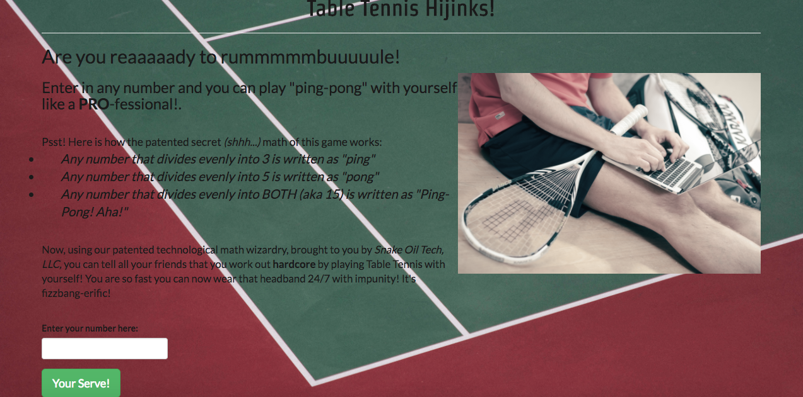

# Table Tennis Hijinks!

#### helping people pretend to play sports with math: since 2016.

#### by Kyle Lange + (http://github.com/kylelange)

## Description

_This is a silly table tennis game that uses numbers divisible by 3,5, and 15 to simulate a game of ping pong. [see it live, here:] (https://kylelange.github.io/ping-pong/)_

#### By _**Kyle Lange**_
_

## Description

## Setup/Installation Requirements

1. Download this repo using your terminal: git clone repo-name pasted here

2. View the code by drag-and-dropping the file into your [favorite text editor](https://atom.io)

3. run/check-out the program by dropping the index/html file from your folder into your web browser

## Known Bugs

_There are no known bugs as of the last commit. Please send an ISSUE on github in the repository if you see something I have not._

## Support and Contact Details

_Any issues with this site, please [e-mail me] (baronsintrees@gmail.com) here._

## Technologies Used

1. **html**
2. **CSS and Bootstrap**
3. **Javascript and jquery-3**
4. **The Human Brain**

## Specs/ Behavior Driven Development: Expected Outcomes.

ONE: The program will accept user input and display each number in the set.
  * _Input: 2_
  * _Output: 1,2_

TWO: The program will accept user input and display "Ping" for numbers divisible by 3.
  * _Input: 3_
  * _Output: 1,2,"Ping"_

THREE: The program will accept user input and display "Pong" for numbers divisible by 5.
  * _Input: 5_
  * _Output: 1,2,"Ping",4,"Pong"_

FOUR: The program will accept user input and display "Ping Pong" for numbers divisible by 15.
  * _Input: 15_
  * _Output: 1,2,"Ping",4,"Pong","Ping",7,8,"Ping","Pong",11,"Ping",13,14,"Ping Pong"_

### License

Copyright (c) 2016 **_Kyle Lange_**

This program is free software: you can redistribute it and/or modify
    it under the terms of the GNU General Public License as published by
    the Free Software Foundation, either version 3 of the License, or
    (at your option) any later version.

    This program is distributed in the hope that it will be useful,
    but WITHOUT ANY WARRANTY; without even the implied warranty of
    MERCHANTABILITY or FITNESS FOR A PARTICULAR PURPOSE.  See the
    GNU General Public License for more details.

    You should have received a copy of the GNU General Public License
    along with this program.  If not, see <http://www.gnu.org/licenses/>.
